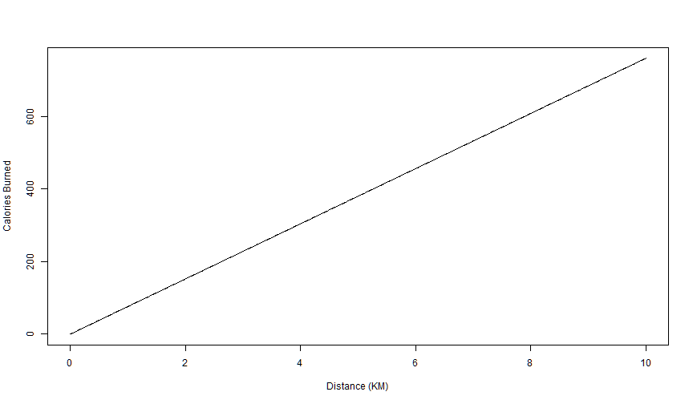

## Introduction

The importance of keeping physically fit is being emphasised on a daily basis. We are slowly starting to understand the impact that physical exercise has on our weight, longevity and even our mental capacity.

In order to help encourage physical exercise, especially running, I have put together this Calorie Calculator. This will give people an understanding of the number of calories that can be burned by engaging in running. Running is one of the easiest ways to get and stay fit as it has very low equipment costs and can be enjoyed both indoors and outdoors.

--- .class #id 

## The Required Inputs

Research has shown that the number of calories burned while running can be estimated quite accurately by using only a few variables, as shown:

1.  *The Age of the runner.* This gives an indication of the heart rate during the run. The age of the runner has an almost negligible impact on the calories burned.
2.  *The Weight of the runner.* This gives an indication of the energy required to move the mass of the runner.
3.  **The Gradient of the route.** This is a very important variable and helps calculate the energy required in lifting the runner's body up and down hills.
4.  **The Distance of the run.** This has the greatest impact on the calories burned.

--- .class #id

## Calculating the Calories Burned

The Calorie Calculator uses the equations defined by R Mergaria et. al. from their experimental data gathering. These equations can be seen at http://www.shapesense.com/fitness-exercise/calculators/running-calorie-burn-calculator.shtml.

For a an average 30-year-old, 80kg runner running on a flat route, the equation below can be used to calculate the calories burned:

$$Calories = (((0.05 * Gradient) + 0.95) * Weight[KG]) * Distance [KM] * CFF$$

Where CFF is an estimate of the $V_{o2}max$, which is calculated using the equation:

$$CFF = 15.3 * Max Heart Rate / Resting Heart Rate$$ 

and Max Heart Rate is calculated using the age of the runner.

--- .class #id

## The Calorie Consumption

For our 30-year-old, 80kg runner, the calories burned over the course of a 10km run can be illustrated:

